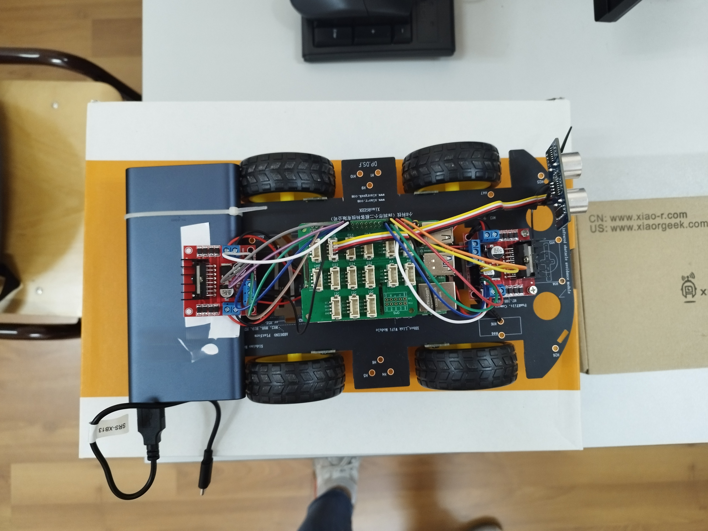
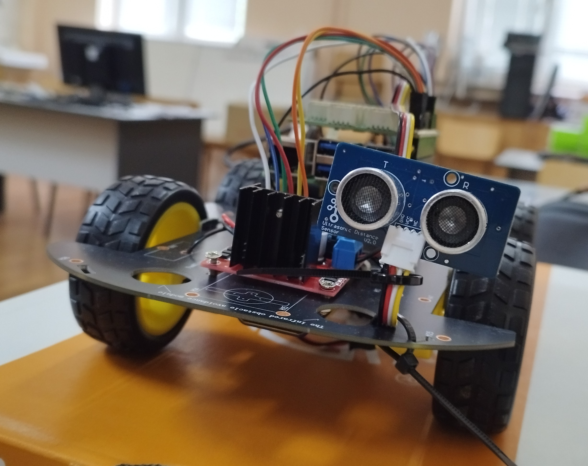
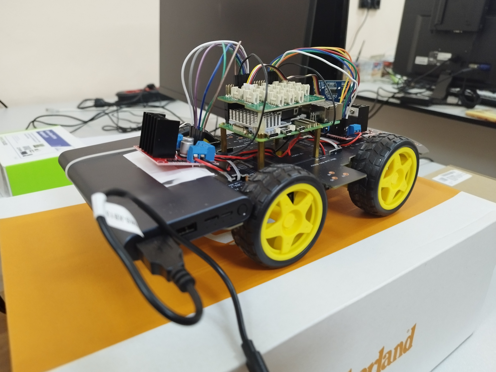

# Prototype of a mini car

The software of a remote controlled car through internet. The main part is a Raspberry Pi that supports small flask server (used to accept the communication commands from the controller) and controlls the mechanical parts. The controller is implemented as a small html file with ineractive button. The idea is that the microcomputer connects to a user's phone network (portable hotspot), the user opens his browser and types down the microcomputer's IP. Then the joystick (button) appears and sends commands through a socket between it and the car. Infront of the car there is small utrasonic sensor that protects from a front crash. If it detects an object close enough to hit, it stops the car immediately.
This project was a course work in Computer systems.

## Technical stack
1. Python (controlling the car)
2. HTML (the controller)

## Mechanical parts
1. [Chassis](https://www.amazon.com/gp/product/B07F759T89)
2. [Motor controllers](https://www.amazon.com/gp/product/B01M29YK5U/)
3. [Raspberry Pi](https://www.raspberrypi.com/)

## Images

  

  

  

